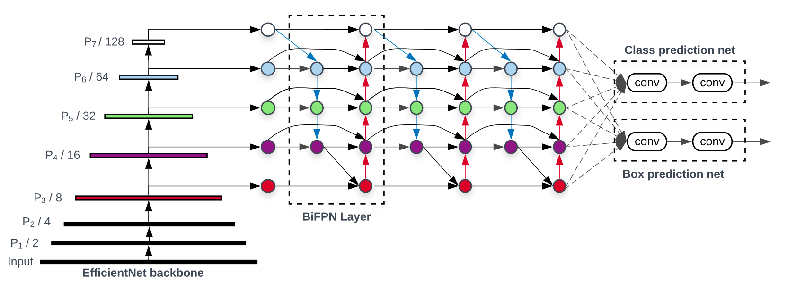

# Custom Object Detector

# One Example

### Table of Contents
- <a href='#recent-update'>Architecture</a>
- <a href='#results'>Results</a>
- <a href='#installation'>Installation</a>
- <a href='#training'>Training</a>
- <a href='#validation'>Validation</a>
- <a href='#training-efficientdet'>Datasets</a>
- <a href='#acknowledgements'>Acknowledgements</a>

## Architecture

This repo implements a novel architecture for object detection. 

The model builds off of the Efficientdet model:



In addition to the feature mixing in the BiFPN layers, this architecture introduces an upsampling connection in 
bounding box and classification heads in order to increase information flow from the features with lower receptive 
field size to the larger features. This is useful for detection tasks where an object can be better identified by 
the combination of multiple smaller objects. For example, for computer UI detection, when identifying lists as
the composition of bullets.

Another change is adding seperate conv layers in the bb/regression heads for each feature size. This is especially
good for tasks where size is an identifying feature of objects. Traditionally, neural nets are meant to be size invariant
because many datasets have objects at different perspectives and distances. However, in datasets such as medical imaging and 
UI object detection, scale is an important feature for the network to be able to learn. It is also because of this that the data
augmentation for this network does not crop or resize the image in a non uniform way.

Other subtler improvements include label smoothing and weighted loss for unbalanced datasets.

## Results


## Installation

1) Clone this repo

2) Install the required packages:

```
apt-get install tk-dev python-tk
```

3) Install the python packages:
	
```
pip install -r requirements.txt
```

## Training

The network can be trained using the `train.py` script. Currently, two dataloaders are available: COCO and CSV. For training on coco, use

```
python train.py --dataset coco --coco_path ../coco --depth 50
```

For training using a custom dataset, with annotations in CSV format (see below), use

```
python train.py --dataset csv --csv_train <path/to/train_annots.csv>  --csv_classes <path/to/train/class_list.csv>  --csv_val <path/to/val_annots.csv>
```

Note that the --csv_val argument is optional, in which case no validation will be performed.

Other flags include

```
--wd int # weight decay
--scales # scales for custom anchor config
--ratios # ratios for custom anchor config
--bs # batch size
--num_epochs # number of epochs to train for
```

Example training script:
```
python3 train.py \
--dataset csv \
--csv_train ./annotations.csv \
--csv_val ./val_annotations.csv \
--csv_classes ./classes.csv 
--ratios 0.262 0.469 1.0 2.133 3.818 \
--scales 0.458 0.779 1.3
```

## Validation

Run `coco_validation.py` to validate the code on the COCO dataset. With the above model, run:

`python coco_validation.py --coco_path ~/path/to/coco --model_path /path/to/model/coco_resnet_50_map_0_335_state_dict.pt`

This produces the following results:

```
 Average Precision  (AP) @[ IoU=0.50:0.95 | area=   all | maxDets=100 ] = 0.335
 Average Precision  (AP) @[ IoU=0.50      | area=   all | maxDets=100 ] = 0.499
 Average Precision  (AP) @[ IoU=0.75      | area=   all | maxDets=100 ] = 0.357
 Average Precision  (AP) @[ IoU=0.50:0.95 | area= small | maxDets=100 ] = 0.167
 Average Precision  (AP) @[ IoU=0.50:0.95 | area=medium | maxDets=100 ] = 0.369
 Average Precision  (AP) @[ IoU=0.50:0.95 | area= large | maxDets=100 ] = 0.466
 Average Recall     (AR) @[ IoU=0.50:0.95 | area=   all | maxDets=  1 ] = 0.282
 Average Recall     (AR) @[ IoU=0.50:0.95 | area=   all | maxDets= 10 ] = 0.429
 Average Recall     (AR) @[ IoU=0.50:0.95 | area=   all | maxDets=100 ] = 0.458
 Average Recall     (AR) @[ IoU=0.50:0.95 | area= small | maxDets=100 ] = 0.255
 Average Recall     (AR) @[ IoU=0.50:0.95 | area=medium | maxDets=100 ] = 0.508
 Average Recall     (AR) @[ IoU=0.50:0.95 | area= large | maxDets=100 ] = 0.597
```

## Visualization

To visualize the network detection, use `visualize.py`:

```
python visualize.py --dataset coco --coco_path ../coco --model <path/to/model.pt>
```
This will visualize bounding boxes on the validation set. To visualise with a CSV dataset, use:

```
python visualize.py --dataset csv --csv_classes <path/to/train/class_list.csv>  --csv_val <path/to/val_annots.csv> --model <path/to/model.pt>
```

## CSV datasets
The `CSVGenerator` provides an easy way to define your own datasets.
It uses two CSV files: one file containing annotations and one file containing a class name to ID mapping.

### Annotations format
The CSV file with annotations should contain one annotation per line.
Images with multiple bounding boxes should use one row per bounding box.
Note that indexing for pixel values starts at 0.
The expected format of each line is:
```
path/to/image.jpg,x1,y1,x2,y2,class_name
```

Some images may not contain any labeled objects.
To add these images to the dataset as negative examples,
add an annotation where `x1`, `y1`, `x2`, `y2` and `class_name` are all empty:
```
path/to/image.jpg,,,,,
```

A full example:
```
/data/imgs/img_001.jpg,837,346,981,456,cow
/data/imgs/img_002.jpg,215,312,279,391,cat
/data/imgs/img_002.jpg,22,5,89,84,bird
/data/imgs/img_003.jpg,,,,,
```

This defines a dataset with 3 images.
`img_001.jpg` contains a cow.
`img_002.jpg` contains a cat and a bird.
`img_003.jpg` contains no interesting objects/animals.


### Class mapping format
The class name to ID mapping file should contain one mapping per line.
Each line should use the following format:
```
class_name,id
```

Indexing for classes starts at 0.
Do not include a background class as it is implicit.

For example:
```
cow,0
cat,1
bird,2
```

## Acknowledgements

- Retinanet implementation [retinanet implementation](https://github.com/fizyr/keras-retinanet)
- Efficientdet implementation [efficientdet implementation](https://github.com/toandaominh1997/EfficientDet.Pytorch)
- The NMS module used is from the [pytorch faster-rcnn implementation](https://github.com/ruotianluo/pytorch-faster-rcnn)

## Examples

